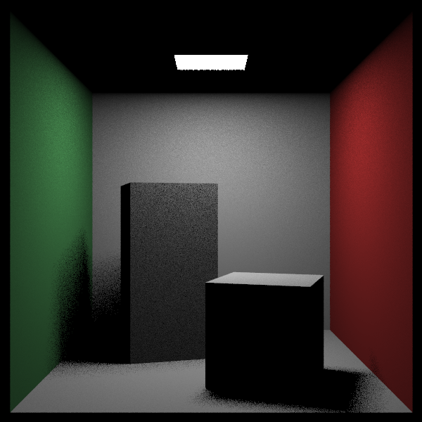
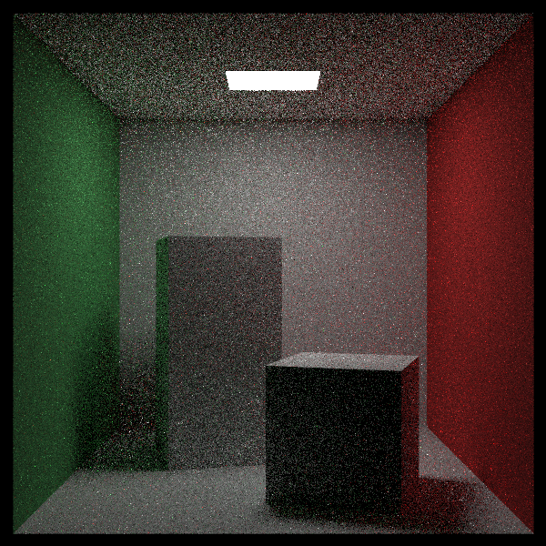

# RayTracing-The-Rest-of-Your-Life

第三部是在之前的基础上，增加了蒙特卡洛积分和BRDF的实现。

这部分涉及了很多数学推导，感觉学到这才算真的踏入图形学的大门 

重新又学了概率论，感觉唤醒了尘封已久的记忆 XD

只有光源

BRDF完整版

参考文章

https://zhuanlan.zhihu.com/p/146144853

http://t.csdnimg.cn/T6rsh
